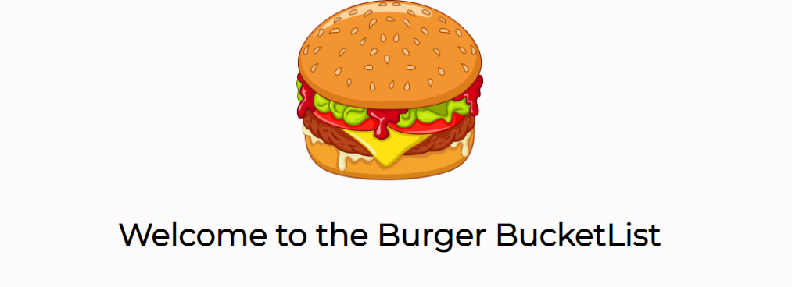

# Burger-BucketList

This is the Burger BucketList it will allow you to add a burger that you have always wanted to eat to a list. Once you achieve your goal of consuming the burger you can move it to a list of burgers you have devoured. This is a full stack application that is backed with MySQL to store all of the user input. This application uses handlebars to render the HTML to the page. This application follows the Model Views Controller pattern. You can view the fully functioning application here: https://hidden-mesa-74828.herokuapp.com/

